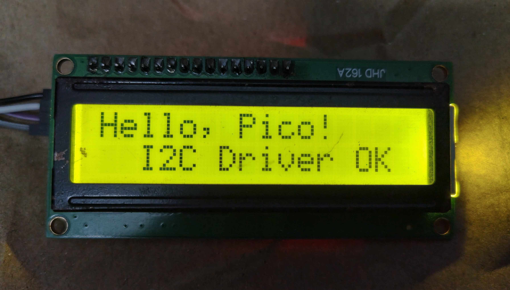

# Raspberry Pi Pico 16x2 I2C LCD DRIVER



A C driver to drive the HD44780 LCD module via the PCF8574 I2C Backpack. This is a modified and restructured version of the official lcd (`lcd_1602_i2c.c`) example code from the legendary [pico-examples](https://github.com/raspberrypi/pico-examples) repo. Since the example given was too complex and all the logic were written in a single file, I restructred the code into different files so that the lcd driver is easy to understand and can be reused elsewhere.

## Pin Configurations

| PCF8574 Backpack | Pi Pico |
| ---------------- | --------------------- |
| **GND** | GND (Any Ground Pin)  |
| **VCC** | VBUS (5V Pin)         |
| **SDA** | GPIO 4 (Pin 6)        |
| **SCL** | GPIO 5 (Pin 7)        |

## How to Build

1. Ensure your `PICO_SDK_PATH` environment variable is set.
2. Clone this repository to your local machine.
3. Open your terminal in the root folder of the project and run the following commands:

```bash
# Create a directory for the build artifacts
mkdir build
cd build

# Generate the build system files
cmake ..

# Compile
make -j4
```